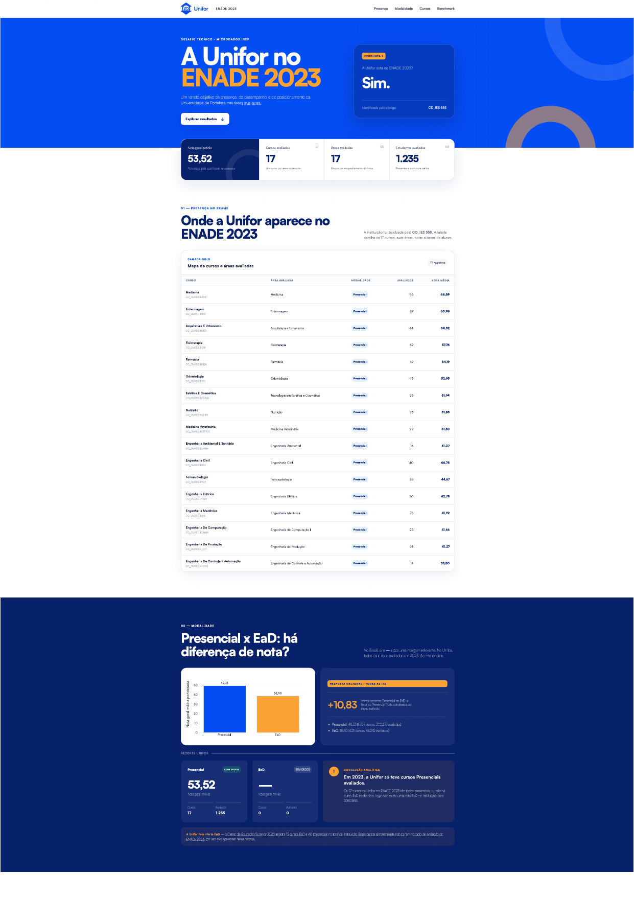
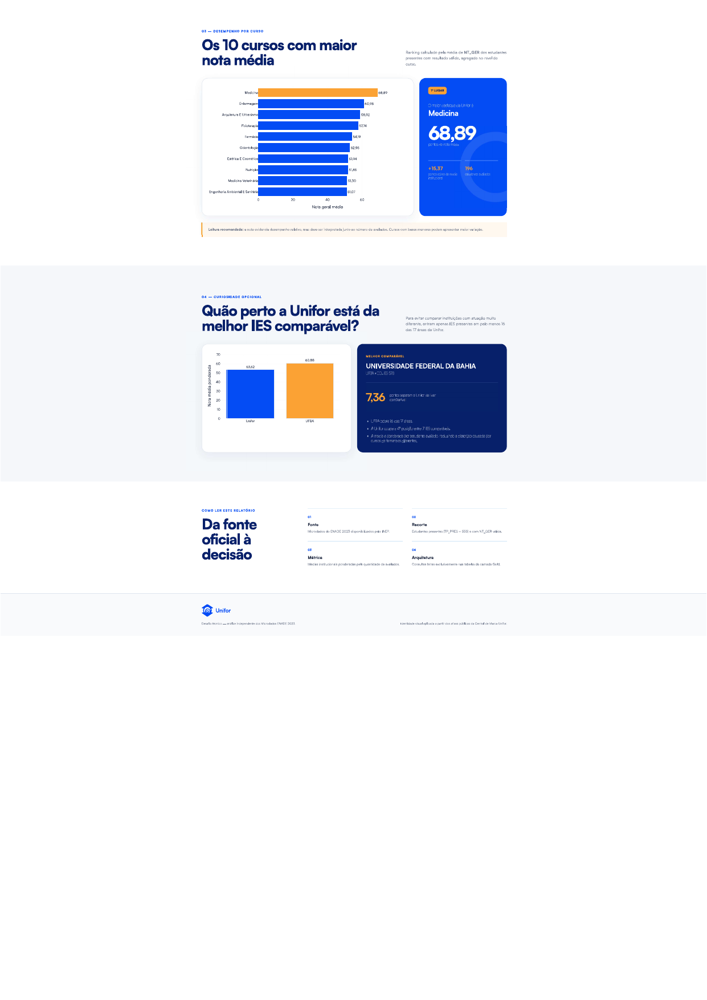

# Desafio Técnico — ENADE 2023

Pipeline local para análise dos Microdados do ENADE 2023, com arquitetura
Bronze, Silver e Gold em DuckDB e um relatório web interativo sobre o
desempenho da Universidade de Fortaleza (Unifor) no exame.

## O que o projeto entrega

- download e extração automatizados dos arquivos oficiais do INEP;
- tratamento e validação dos dados em notebooks reproduzíveis;
- banco local DuckDB organizado nas camadas Bronze, Silver e Gold;
- dashboard web responsivo, desenvolvido com Flask, HTML, CSS e Plotly;
- execução via Docker Compose ou por arquivos `.bat` no Windows.

O dashboard responde às seguintes perguntas:

1. A Unifor está no ENADE 2023? Quais cursos, áreas e modalidades aparecem?
2. A nota média difere entre cursos presenciais e EaD?
3. Quais são os dez cursos da Unifor com maior nota média?
4. Qual é a melhor IES comparável nas áreas em que a Unifor atua e qual é a diferença? *(curiosidade opcional)*

## Como executar

### Opção 1 — Docker Compose (recomendado)

Pré-requisito: Docker e Docker Compose instalados.

```bash
docker compose up --build
```

Na primeira execução, o container roda a pipeline completa (download dos
microdados, tratamento e criação do banco `enade.duckdb`) e em seguida
inicia o dashboard. Isso pode levar alguns minutos. Nas execuções
seguintes, o container detecta que o banco já existe (persistido no
volume `./data`) e pula direto para o dashboard.

Acesse:

```text
http://localhost:8050
```

Para encerrar, `Ctrl + C` no terminal ou `docker compose down`.

> **Testado com execução limpa (clean run).** Antes da entrega, essa opção foi validada de ponta a ponta simulando exatamente o ambiente de quem for avaliar: com a pasta `data/` removida (sem `enade.duckdb` nem microdados baixados), `docker compose up --build` reconstruiu a imagem do zero, baixou os microdados do INEP, executou os dois notebooks e subiu o dashboard com sucesso, sem nenhuma dependência pré-instalada além do Docker.

### Opção 2 — Windows, com arquivos `.bat`

#### 1. Baixar o projeto

No GitHub, clique em **Code > Download ZIP** e extraia a pasta. Também é
possível clonar o repositório com GitHub Desktop.

#### 2. Configurar o ambiente

Dê dois cliques em:

```text
configurar_ambiente.bat
```

Esse arquivo cria a pasta `.venv` e instala as bibliotecas listadas em
`requirements.txt`. Essa etapa é necessária apenas na primeira execução.

#### 3. Executar a pipeline

Dê dois cliques em:

```text
executar_pipeline.bat
```

A pipeline executa os notebooks na ordem correta e gera o banco:

```text
data/database/enade.duckdb
```

#### 4. Abrir o dashboard

Dê dois cliques em:

```text
executar_dashboard.bat
```

O navegador será aberto automaticamente em:

```text
http://127.0.0.1:8050
```

Para encerrar o dashboard, feche a janela preta que foi aberta pelo arquivo
`.bat` ou pressione `Ctrl + C` nela.

## Fluxo do projeto

```text
Microdados INEP (ENADE 2023 + Censo da Educação Superior 2023)
      ↓
Notebook 1 — download e extração (camada Bronze)
      ↓
Notebook 2 — tratamento (Silver) e modelagem dimensional (Gold)
      ↓
data/database/enade.duckdb
      ↓
Flask + Plotly, consultando exclusivamente a camada Gold
      ↓
Dashboard no navegador
```

## Modelo de dados (camada Gold)

A camada Gold segue um modelo dimensional (esquema estrela), em que
`fato_desempenho_curso` se relaciona **somente** com `dim_cursos`, por
`CO_CURSO`. A dimensão de cursos funciona como ponto central para as
demais dimensões — nenhuma tabela analítica duplica esses atributos.

```text
dim_ies ────────────┐
dim_grupo ──────────┤
dim_modalidade ─────┼── dim_cursos ─── fato_desempenho_curso
dim_localizacao ────┘
```

| Tabela | Grão / chave | Registros | Descrição |
|---|---|---|---|
| `dim_cursos` | 1 linha por `CO_CURSO` (PK) | 9.812 | Curso, IES, área e modalidade; tabela central do modelo |
| `dim_ies` | 1 linha por `CO_IES` (PK) | 1.347 | Código, nome e sigla da instituição |
| `dim_grupo` | 1 linha por `CO_GRUPO` (PK) | 28 | Área avaliada pelo ENADE |
| `dim_modalidade` | 1 linha por `CO_MODALIDADE` (PK) | 2 | Presencial (1) ou EaD (0) |
| `dim_localizacao` | 1 linha por `CO_MUNIC_CURSO` (PK) | 718 | Município e UF de oferta do curso |
| `fato_desempenho_curso` | 1 linha por `CO_CURSO` | 9.380 | `NT_GER_MEDIA` e `QT_AVALIADOS` por curso |

A fato tem uma linha a menos que `dim_cursos` (9.380 x 9.812) porque nem
todo curso cadastrado teve alunos com nota válida no ENADE 2023 — esses
casos ficam sem linha correspondente na fato, mas continuam existindo na
dimensão (ver seção de premissas).

## Regras analíticas

- somente estudantes presentes (`TP_PRES = 555`) e com `NT_GER` válida entram
  no cálculo;
- a tabela fato possui uma linha por curso;
- a média institucional é sempre ponderada por `QT_AVALIADOS` (nunca uma
  média simples entre cursos), para não distorcer o resultado de cursos
  com poucos ou muitos avaliados;
- o dashboard consulta exclusivamente tabelas da camada Gold;
- a comparação nacional considera IES presentes em pelo menos 16 das 17 áreas
  avaliadas da Unifor, evitando instituições com cobertura muito diferente.

## Perguntas respondidas

As respostas abaixo vêm das consultas SQL executadas diretamente sobre a
camada Gold, no notebook `2. Exploração Microdados ENADE.ipynb` (seção 06)
e reproduzidas no dashboard.

### 1. A Unifor está no ENADE 2023?

Sim. A Unifor (`CO_IES = 555`) está presente no ENADE 2023, com **17
cursos avaliados**, distribuídos em **17 áreas** diferentes, todos
ofertados na modalidade **Presencial** — não há cursos EaD da Unifor no
ciclo avaliado. Os cursos são: Arquitetura e Urbanismo, Enfermagem,
Engenharia Ambiental e Sanitária, Engenharia Civil, Engenharia de
Computação, Engenharia de Controle e Automação, Engenharia de Produção,
Engenharia Elétrica, Engenharia Mecânica, Estética e Cosmética,
Farmácia, Fisioterapia, Fonoaudiologia, Medicina, Medicina Veterinária,
Nutrição e Odontologia.

### 2. A nota média difere entre presencial e EaD?

Sim, nacionalmente. Considerando todas as IES do ENADE 2023: cursos
**Presenciais** somam 8.757 cursos, 300.277 avaliados e nota média
ponderada de **49,73**; cursos **EaD** somam 623 cursos, 46.242 avaliados
e nota média ponderada de **38,90** — uma diferença de **10,83 pontos**
a favor do presencial. Como todos os 17 cursos da Unifor são presenciais,
não há uma comparação interna Presencial x EaD possível para a própria
instituição; a nota média presencial da Unifor é **53,52** (1.235
avaliados), acima da média nacional presencial.

### 3. Quais são os dez cursos da Unifor com maior nota média?

| # | Curso | Área | Nota média | Avaliados |
|---|---|---|---|---|
| 1 | Medicina | Medicina | 68,89 | 196 |
| 2 | Enfermagem | Enfermagem | 60,98 | 57 |
| 3 | Arquitetura e Urbanismo | Arquitetura e Urbanismo | 58,92 | 144 |
| 4 | Fisioterapia | Fisioterapia | 57,74 | 52 |
| 5 | Farmácia | Farmácia | 54,19 | 42 |
| 6 | Odontologia | Odontologia | 52,95 | 149 |
| 7 | Estética e Cosmética | Tecnologia em Estética e Cosmética | 51,94 | 23 |
| 8 | Nutrição | Nutrição | 51,85 | 93 |
| 9 | Medicina Veterinária | Medicina Veterinária | 51,30 | 92 |
| 10 | Engenharia Ambiental e Sanitária | Engenharia Ambiental | 51,07 | 16 |

### 4. Curiosidade opcional — melhor IES comparável

Considerando apenas IES que cobrem pelo menos 16 das 17 áreas em que a
Unifor atua (critério explicado em "Premissas"), foram encontradas 7 IES
comparáveis. A líder nacional entre elas é a **UFBA** (Universidade
Federal da Bahia), com nota média ponderada de **60,88** (16 áreas,
1.258 avaliados). A Unifor ocupa a **4ª posição** nesse grupo, com nota
**53,52** — **7,36 pontos** abaixo da líder. Área a área, a distância da
Unifor para a melhor IES do Brasil naquela área varia de **8,84 pontos**
(Medicina, a área mais próxima da liderança) a **30,56 pontos**
(Engenharia Civil, a área mais distante) — o detalhamento completo está
no notebook, seção 06.

## Checagens de qualidade dos dados

Três validações de qualidade foram aplicadas antes da gravação da camada
Gold (notebook `2. Exploração Microdados ENADE.ipynb`):

1. **Duplicidade de `CO_CURSO`.** Verificação de atributos conflitantes
   por curso na base bruta (0 conflitos entre 9.812 cursos únicos) e
   confirmação de unicidade da chave após deduplicação na Silver (0
   duplicados). O pipeline interrompe a execução (`raise ValueError`) caso
   qualquer uma dessas checagens falhe.
2. **Integridade referencial fato ↔ dimensão.** Validado com `LEFT JOIN`
   entre `fato_desempenho_curso` e `dim_cursos`: os 9.380 registros da
   fato têm correspondência garantida em `dim_cursos` (0 órfãos).
3. **Tratamento de `NT_GER` nulo.** Dos 406.294 registros originais de
   notas, **59.775 (14,7%)** foram descartados por ausência do aluno na
   prova (`TP_PRES ≠ 555`) ou nota nula, restando 346.519 registros
   válidos, com 0 nulos residuais na camada Silver.

## Fonte e período dos dados

- **ENADE 2023** — Microdados oficiais do INEP, baixados diretamente de
  `https://download.inep.gov.br/microdados/microdados_enade_2023.zip`
  (notebook `1. Download Microdados ENADE.ipynb`).
- **Censo da Educação Superior 2023** — arquivos
  `MICRODADOS_CADASTRO_CURSOS_2023.CSV` e `MICRODADOS_ED_SUP_IES_2023.CSV`,
  usados para obter nome de curso, nome e sigla da IES.

Ambas as bases são microdados públicos e anonimizados pelo INEP — não há
dado pessoal identificável em nenhuma etapa da pipeline, e o
relacionamento entre arquivos ocorre apenas no nível agregado de curso
(`CO_CURSO`), nunca no nível do estudante individual, conforme exigido
pela própria anonimização do ENADE.

## Premissas e critérios assumidos

- `CO_IES = 555` corresponde à Universidade de Fortaleza (Unifor),
  confirmado por `SG_IES = 'UNIFOR'` no cadastro de IES do Censo.
- `TP_PRES = 555` identifica o aluno que efetivamente compareceu à
  prova, conforme o dicionário oficial de variáveis do ENADE; apenas
  esses registros, com `NT_GER` preenchida, entram no cálculo das notas.
- O código de modalidade usado na camada Gold (`CO_MODALIDADE`: 0 = EaD,
  1 = Presencial) é específico do ENADE e **difere** do código
  `TP_MODALIDADE_ENSINO` usado na tabela bruta do Censo (1 = Presencial,
  2 = EaD), consultada isoladamente pelo dashboard só para exibir a
  contagem de cursos por modalidade no cadastro da Unifor. Os dois
  códigos não se misturam em nenhuma consulta, mas ficam registrados
  aqui para evitar confusão em manutenções futuras.
- Uma IES é considerada "comparável" à Unifor quando cobre pelo menos 16
  das 17 áreas em que a Unifor atua (critério n-1), para evitar comparar
  a Unifor com instituições de portfólio de cursos muito diferente.
- A nota institucional (por IES) é sempre uma média ponderada por
  `QT_AVALIADOS`, nunca uma média simples entre cursos.

## Capturas de tela do dashboard

**Visão geral, mapa de cursos avaliados e comparação Presencial x EaD**



**Top 10 cursos por nota média e comparação com a melhor IES comparável**



## Estrutura do repositório

```text
DESAFIO UNIFOR/
├── 1. Download Microdados ENADE.ipynb   # Bronze: download e extração
├── 2. Exploração Microdados ENADE.ipynb # Silver/Gold: tratamento e modelo dimensional
├── run_pipeline.py                      # Executa os dois notebooks em sequência
├── dashboard/
│   ├── app.py                           # Flask + consultas SQL na Gold + Plotly
│   ├── static/                          # CSS, fontes e imagens (identidade Unifor)
│   └── templates/
│       └── index.html
├── data/
│   ├── raw/                             # Microdados baixados (gerado, gitignored)
│   └── database/                        # enade.duckdb (gerado, gitignored)
├── artifacts/                           # Notebooks executados pela pipeline (gerado, gitignored)
├── Dockerfile
├── docker-compose.yml
├── docker-entrypoint.sh
├── configurar_ambiente.bat
├── executar_pipeline.bat
├── executar_dashboard.bat
├── requirements.txt
├── docs/
│   └── screenshots/                     # Capturas de tela usadas neste README
└── README.md
```

## Tecnologias

Python, Pandas, DuckDB, Jupyter, Flask, Plotly, HTML, CSS e Docker.

### Por que DuckDB

Nunca havia trabalhado com DuckDB antes deste desafio — a escolha foi
motivada pelo pouco tempo disponível para o projeto, mas se mostrou
tecnicamente adequada por razões concretas:

- é um motor **OLAP colunar e vetorizado**, embarcado em um único
  arquivo, sem processo de servidor para instalar, configurar ou
  gerenciar — ideal para uma pipeline analítica local e de usuário
  único, como este desafio;
- tem integração nativa e praticamente sem cópia com Pandas (via
  `conexao.register`), o que elimina a etapa de exportar/importar dados
  entre o tratamento em Python e o banco;
- suporta SQL completo (CTEs, window functions) usado diretamente para
  responder às perguntas de negócio sobre a camada Gold, sem depender de
  lógica adicional em Python;
- comparado ao **SQLite** (também embarcado): o SQLite é otimizado para
  cargas transacionais linha a linha (OLTP), enquanto o DuckDB é
  vetorizado e colunar, desenhado para agregações (`SUM`, `AVG`,
  `COUNT` sobre centenas de milhares de linhas) — exatamente o padrão de
  consulta deste projeto, e sensivelmente mais rápido nesse cenário;
- comparado a um motor cliente-servidor como **PostgreSQL** ou
  **MySQL**: não exige processo de servidor, criação de usuários ou
  gerenciamento de permissões — o que reduziu a complexidade de setup
  dado o prazo curto do desafio, ao custo de não ter os controles de
  acesso multiusuário desses motores (ver "Limitações conhecidas").

## Reprodutibilidade do ambiente

O `requirements.txt` lista as bibliotecas do projeto pelo nome, sem
versão fixada: `pandas`, `openpyxl`, `duckdb`, `jupyter`, `nbconvert`,
`ipykernel`, `plotly`, `requests`, `curl_cffi` e `flask`. Isso significa
que cada instalação traz a versão mais recente disponível de cada
pacote no momento da execução — prático durante o desenvolvimento, mas
sem garantia de reprodutibilidade determinística entre execuções em
datas diferentes. O Dockerfile mitiga parcialmente esse risco ao fixar a
versão do Python (3.11-slim) e isolar o ambiente do sistema operacional
host, mas não fixa as versões das bibliotecas Python em si. Ponto de
melhoria: gerar um `requirements.txt` com versões travadas (`pip
freeze`) antes de qualquer uso além deste desafio.

## Identidade visual

O relatório usa o logotipo, a tipografia Satoshi e referências cromáticas
disponibilizadas publicamente na
[Central de Marca da Unifor](https://unifor.br/central-de-marca). O material é
apresentado como análise independente produzida para o desafio técnico.

## Processo de desenvolvimento e decisões de projeto

- **Apoio de IA.** O desenvolvimento contou com apoio de duas
  ferramentas de IA — ChatGPT (Codex) e Claude (Cowork) — usadas de
  forma deliberadamente segmentada por etapa do projeto, para melhor
  aproveitamento dos tokens disponíveis em cada uma.
- **Arquivos `.bat`.** Optei por criar múltiplos arquivos `.bat`
  (`configurar_ambiente.bat`, `executar_pipeline.bat`,
  `executar_dashboard.bat`) para simplificar a execução e a auditoria do
  projeto por quem for avaliar o desafio, sem exigir conhecimento prévio
  de linha de comando ou Python.
- **Docker Compose.** Esta foi a primeira vez que construí uma
  configuração de Docker Compose; a estrutura (Dockerfile,
  docker-compose.yml, docker-entrypoint.sh) foi desenvolvida com apoio
  do Claude Cowork, a partir da qual fiz pequenos ajustes e melhorias.
- **Front-end.** Apesar de ter ampla experiência com Power BI, duas
  limitações práticas levaram à escolha de um dashboard web: acesso
  limitado ao computador de trabalho habitual (foi necessário usar um
  notebook mais antigo, por estar em viagem a trabalho) e tempo
  insuficiente, dentro do prazo do desafio, para construir os
  backgrounds no Figma e desenvolver medidas e páginas no Power BI.
  Diante disso, o dashboard (Flask + Plotly) foi construído
  integralmente com apoio do Claude Cowork, direcionando a IA apenas
  quanto à identidade visual da Unifor e à necessidade de fácil leitura
  e compreensão por parte de quem avalia.

## Limitações conhecidas

- **Notebook único e sequencial.** A camada Gold foi construída em um
  único notebook, com células executadas em sequência linear. Esse
  formato dificulta auditoria e correções pontuais no futuro — alterar
  uma etapa intermediária exige reexecutar o notebook inteiro, sem
  separação clara entre módulos reutilizáveis (extração, tratamento,
  modelagem, respostas).
- **Ausência de testes automatizados.** As checagens de qualidade
  (duplicidade, integridade referencial, tratamento de nulos) existem
  apenas como validações manuais dentro do notebook (`raise
  ValueError`, `print`). Não há suíte de testes automatizados (por
  exemplo, `pytest`) rodando de forma independente do notebook.
- **Segurança e governança de dados.** Ao final do desenvolvimento do
  back-end, ficou evidente a ausência de: validação dos arquivos
  baixados quanto a vírus ou conteúdo malicioso; avaliação formal sobre
  a segurança de conceder às IAs (Claude e ChatGPT) acesso ao banco
  local durante o desenvolvimento; restrições de acesso ao banco DuckDB
  dentro do container Docker; e gerenciamento de permissões/usuários do
  banco. Como o uso é local e individual, e os microdados são públicos e
  anonimizados, o risco é baixo neste contexto — mas essas lacunas
  precisariam ser endereçadas antes de qualquer uso compartilhado ou
  produtivo.
- **Versões de dependências não fixadas**, detalhado na seção
  "Reprodutibilidade do ambiente".
- **Cobertura desigual entre IES no comparativo nacional.** O critério
  de "IES comparável" (≥16 de 17 áreas) reduz, mas não elimina,
  distorções: uma IES com poucos alunos avaliados em uma área específica
  pesa da mesma forma que uma IES com centenas.

## Próximos passos

- Refatorar o notebook de tratamento em módulos Python testáveis, com
  testes automatizados (`pytest`) cobrindo as checagens de qualidade já
  existentes.
- Fixar as versões das bibliotecas em `requirements.txt` (`pip freeze`)
  para reprodutibilidade determinística.
- Adicionar validação de segurança dos arquivos de entrada e revisar
  permissões de acesso ao banco antes de qualquer uso compartilhado.
- Duas análises adicionais, voltadas para crescimento de curso,
  captação de alunos e marketing:
  - **Nota ENADE como ativo de posicionamento e captação.** A consulta
    de curiosidade já calcula, por área, a distância da Unifor para a
    melhor IES do Brasil e o percentil em que a Unifor se encontra
    (`PERCENTIL_TOP`). Transformar esse indicador em um painel de
    "cursos prontos para campanha" ajudaria o marketing a priorizar,
    com dados, quais cursos já têm nota suficiente para virar material
    de divulgação (ex.: Medicina, próxima do topo nacional da área), e
    quais precisam de reforço acadêmico antes de qualquer investimento
    em captação — evitando prometer mais do que a IES entrega.
  - **Nota ENADE x evolução de vagas e matrículas (Censo da Educação
    Superior).** O Censo, hoje usado neste projeto apenas para nome de
    curso e de IES, também traz série histórica de vagas oferecidas,
    inscritos e matrículas por curso. Incorporar esses campos
    permitiria correlacionar a nota de cada curso com o crescimento (ou
    queda) de matrículas ano a ano — um insumo direto para a
    coordenação decidir em quais cursos vale investir em marketing para
    crescer a captação, e em quais o problema não é demanda de
    mercado, mas qualidade acadêmica a corrigir primeiro.

## Autoria

Virgínia Madeira Barros de Queiroz
E-mail: vihbarrosm@gmail.com
LinkedIn: [linkedin.com/in/vmbq](https://www.linkedin.com/in/vmbq/)
